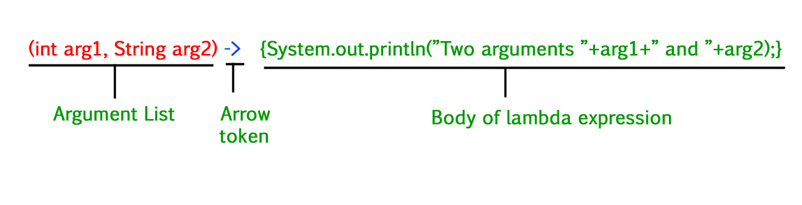

In Java, Lambda expressions basically express instances of functional interfaces (An interface with a single abstract method is called a functional interface). Ex : Runnable,Comparable. Lambda Expressions in Java are the same as lambda functions which are the short block of code that accepts input as parameters and returns a resultant value. 

Functional Programming-:Functions that can take other functions as arguments or return functions as results to the variable.

Lambda Expressions implement the only abstract function and therefore implement functional interfaces lambda expressions are added in Java 8 and provide the below functionalities.
1) Enable to treat functionality as a method argument, or code as data.
2) A function that can be created without belonging to any class.
3) A lambda expression can be passed around as if it was an object and executed on demand.



Lambda Expression is a anonymous function with no name, no modifier, no return type. After introduction of this Java is now Functional Programming Language 
Advantages of Lambda Expression-:
1) It reduces the lines of code
2) Sequential and parallel execution support by passing behaviour as an argument in methods
3) To calls API very easily

Important Rules-:
1) If the body of Lambda Expression contains only one statement then curly braces are optional else we have to provide brackets
2) Java compiler also interpret the type of variable passed in arguments, hence type is optional(means we dont have to mention int, float,String etc in lambda expression, but we have to mention them in functional interface jisko vo implement kr rhe hai)

```java
public interface MyInterface {
    public void sayHello();
}

// Now to implement this function you have to create a new class and implement this interface then implement the body of function.
// Or we can use Anonymous class to implement this interface

class Main{
    MyInterface myInterface=new MyInterface() {
        @Override
        public void sayHello() {
            System.out.println("Hello");
        }
    };
}
// Or we can use lambda expression
``` 

